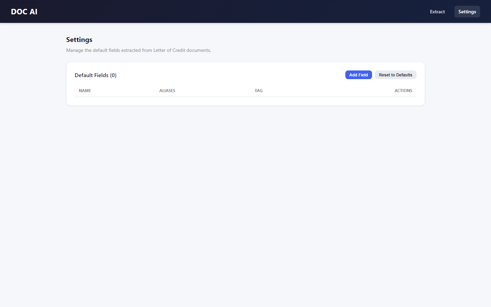
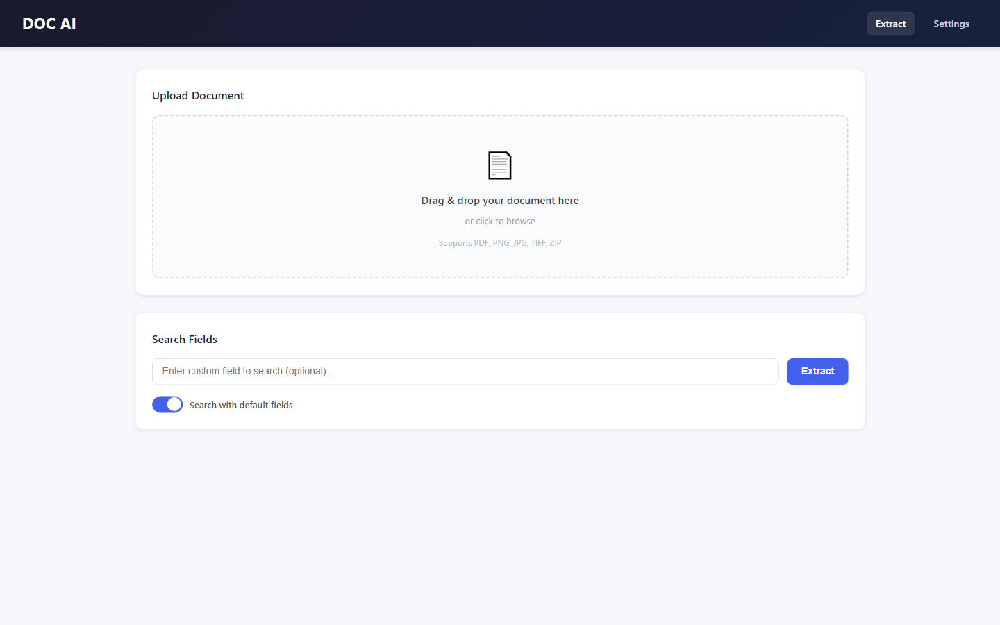

# Doctern - AI Document OCR and Table Extraction

> Turns scanned documents into structured data, with table extraction that survives real-world scans.

Built by **[Muhammad Tanveer](https://www.linkedin.com/in/muhammad-tanveer-advenno/)** - Full-Stack AI Automation Engineer.

 

## Contents

- [The problem](#the-problem)
- [The approach](#the-approach)
- [Architecture](#architecture)
- [Tech stack](#tech-stack)
- [Key capabilities](#key-capabilities)
- [Screenshots](#screenshots)
- [Results](#results)
- [FAQ](#faq)
- [Source code and access](#source-code-and-access)
- [About the engineer](#about-the-engineer)
- [Related projects](#related-projects)

## The problem

Scanned documents hold data nobody can query. Generic OCR returns a wall of text and loses the table structure, which is usually the part that actually mattered.

## The approach

An OCR pipeline that preserves layout, with a dedicated table-extraction stage so rows and columns survive as structure rather than being flattened into text. A web interface handles upload and review, because extraction from imperfect scans needs human confirmation.

## Architecture

| Component | Responsibility |
| --- | --- |
| **Upload and preprocessing** | Document intake and image preparation |
| **OCR engine** | Text recognition with layout preservation |
| **Table extraction** | Row and column structure recovery |
| **Review interface** | Human verification of extracted output |
| **Export** | Structured data output |

## Tech stack

| Layer | Technology |
| --- | --- |
| Backend | Python |
| OCR | Layout-aware recognition |
| Frontend | Web upload and review interface |
| Output | Structured exportable data |

## Key capabilities

- Layout-preserving OCR
- Table structure extraction
- Browser-based upload and review
- Structured export

## Screenshots

## Results

- Scanned tables recovered as data rather than flattened text
- Human review built into the flow instead of assumed-perfect extraction

## FAQ

### How is this different from ordinary OCR?

Ordinary OCR returns text and loses table structure. This pipeline recovers rows and columns as structure.

### What document types does it handle?

Scanned documents and PDFs where the useful content is tabular.

### Is extraction fully automatic?

Extraction is automatic; a review step lets a human confirm before export, which real-world scan quality requires.

### Is the source available?

Private repository.

## Source code and access

This repository is the public case study for **Doctern - AI Document OCR and Table Extraction**. The full implementation - application code, database schema, tests and deployment configuration - lives in a **private repository** on this account, alongside the rest of the work shown here.

Source access can be arranged for hiring conversations, technical review or client due diligence. The quickest route is a short message on [LinkedIn](https://www.linkedin.com/in/muhammad-tanveer-advenno/) or an email to [mtanveertahir66@gmail.com](mailto:mtanveertahir66@gmail.com).

## About the engineer

**Muhammad Tanveer - Full-Stack AI Automation Engineer**

Full-stack AI automation engineer. I build agentic systems, browser and workflow automation, RAG pipelines and the production web platforms they run on - from Rust and Python services to Next.js dashboards and PHP/MySQL business systems.

- GitHub: [haddindeve](https://github.com/haddindeve)
- LinkedIn: [Muhammad Tanveer](https://www.linkedin.com/in/muhammad-tanveer-advenno/)
- Email: [mtanveertahir66@gmail.com](mailto:mtanveertahir66@gmail.com)
- Location: Pakistan

## Related projects

- [Tahir Collection - Stockinette Manufacturer Web Platform](https://github.com/haddindeve/tahir-collection-stockinette-manufacturer)
- [Offline-First Restaurant POS](https://github.com/haddindeve/restaurant-pos-offline-first)
- [AI Sales Agent - Automated Lead Generation and Outreach](https://github.com/haddindeve/advenno-ai-sales-agent)
- [Lunaria - Privacy-First Women's Wellness App](https://github.com/haddindeve/lunaria-womens-wellness-app)
- [Local Pulse - Google Maps CTR Automation Platform](https://github.com/haddindeve/local-pulse-maps-ctr-platform)
- [ATM Electronic Journal Parser and GL Reconciliation](https://github.com/haddindeve/ej-rolls-atm-reconciliation)

---

Doctern - AI Document OCR and Table Extraction - case study by Muhammad Tanveer - Full-Stack AI Automation Engineer. Keywords: document OCR software, table extraction AI, scanned document processing, intelligent document processing, PDF data extraction, OCR automation.